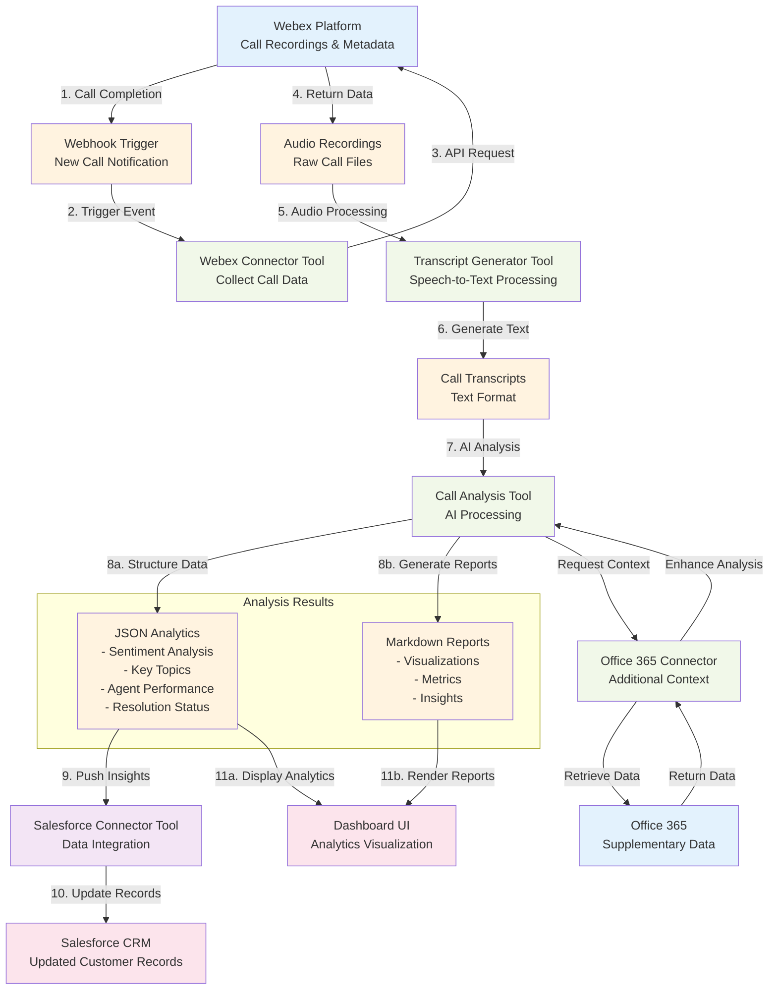

# Data Flow Diagram

## Overview
This diagram shows the complete data journey from Webex call completion through AI analysis to Salesforce integration, illustrating how call recordings are transformed into actionable business insights.

## Data Flow Diagram

## Data Flow Steps

### 1. Call Initiation & Completion
- **Webex Platform** hosts and records customer calls
- Call completion triggers automated webhook notification

### 2. Data Collection Trigger
- **Webhook notification** received by Webex Connector Tool
- System initiates automatic data collection process

### 3. Call Data Retrieval
- **Webex Connector Tool** makes authenticated API calls to Webex
- Retrieves call metadata and audio recordings

### 4. Audio Processing
- **Raw audio recordings** passed to Transcript Generator Tool
- Advanced speech-to-text processing converts audio to text

### 5. AI Analysis
- **Call transcripts** processed by Call Analysis Tool
- AI algorithms perform:
  - Sentiment analysis throughout the call timeline
  - Key topic and phrase extraction
  - Call categorization and tagging
  - Agent performance evaluation

### 6. Data Structuring & Reporting
- **Analysis results** formatted into two outputs:
  - **JSON Analytics**: Structured data for API consumption
  - **Markdown Reports**: Human-readable reports with visualizations

### 7. Salesforce Integration
- **Call insights and metadata** pushed to Salesforce
- Customer records updated with call analysis results
- New opportunities and follow-up tasks created automatically

### 8. Supplementary Data Enhancement
- **Office 365 integration** provides additional context
- Customer communication history and calendar data enhance analysis accuracy

### 9. Dashboard Visualization
- **JSON analytics** power real-time dashboard displays
- **Markdown reports** rendered in user interface
- Interactive visualizations show trends and insights

## Data Types & Formats

### Input Data
- **Audio Files**: WAV, MP3, or proprietary Webex formats
- **Call Metadata**: Duration, participants, timestamps, call ID
- **Webhook Payloads**: JSON notifications from Webex

### Intermediate Data
- **Transcripts**: Text format with timestamps and speaker identification
- **Raw Analysis**: Unstructured AI processing results

### Output Data
- **Structured Analytics**: JSON format with standardized schema
- **Visual Reports**: Markdown with embedded charts and metrics
- **Salesforce Records**: CRM-compatible data structures

## Performance Considerations

### Processing Pipeline
- **Asynchronous Processing**: Webhook triggers enable non-blocking data collection
- **Parallel Analysis**: Multiple AI models process different aspects simultaneously
- **Batch Operations**: Efficient API calls minimize external system load

### Data Volume Management
- **Streaming Transcription**: Large audio files processed in chunks
- **Incremental Analysis**: Real-time sentiment tracking during long calls
- **Compressed Storage**: Optimized data formats reduce storage requirements

## Error Handling & Recovery

### Failure Points
- **Webex API Unavailability**: Retry mechanisms with exponential backoff
- **Transcription Failures**: Fallback to alternative speech-to-text services
- **Salesforce Integration Issues**: Queue-based retry system for data push operations

### Data Integrity
- **Checksum Validation**: Ensure audio file integrity during transfer
- **Analysis Verification**: Quality checks on AI processing results
- **Audit Trails**: Complete logging of data transformations and system interactions