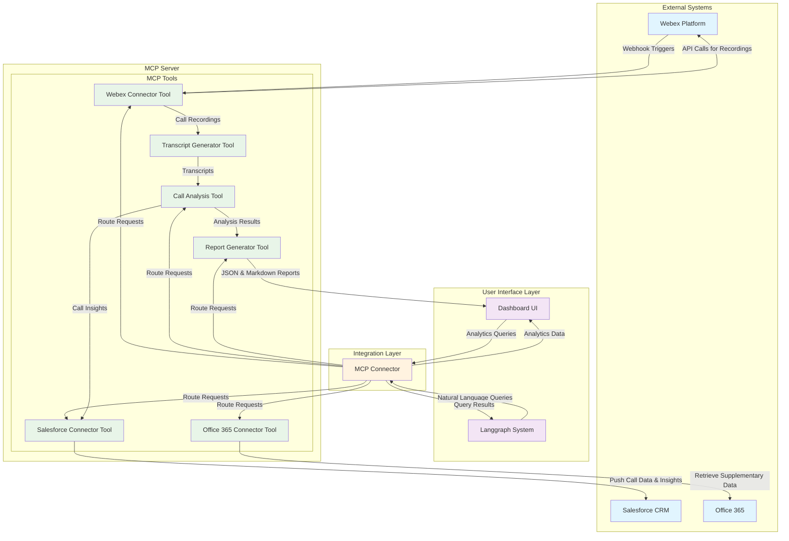

# System Interaction Diagram

## Overview
This diagram illustrates how the AI Native Telecom Analytics system components interact with each other, including external systems (Webex, Salesforce, Office 365) and internal components (MCP Server, Dashboard UI, Langgraph).

## Interaction Diagram

## Component Descriptions

### External Systems
- **Webex Platform**: Source of call recordings and metadata, provides webhook notifications
- **Salesforce CRM**: Target system for call insights and customer record updates
- **Office 365**: Supplementary data source for additional context

### User Interface Layer
- **Dashboard UI**: Primary visualization interface for analytics and reports
- **Langgraph System**: Natural language query interface for intelligent system interaction

### Integration Layer
- **MCP Connector**: Middleware that routes requests between UI components and MCP Server

### MCP Tools (Core Processing)
- **Webex Connector Tool**: Handles Webex API interactions and call data retrieval
- **Salesforce Connector Tool**: Manages Salesforce integration and data push operations
- **Office 365 Connector Tool**: Retrieves supplementary data from Office 365
- **Transcript Generator Tool**: Converts audio recordings to text transcripts
- **Call Analysis Tool**: Performs AI-driven analysis on call transcripts
- **Report Generator Tool**: Creates structured JSON and markdown reports

## Key Interaction Patterns

1. **Event-Driven Collection**: Webex webhooks trigger automatic call data collection
2. **API-Based Integration**: REST APIs enable seamless data exchange with external systems
3. **Centralized Processing**: MCP Server serves as the central hub for all tool operations
4. **Multi-Channel Output**: Results are delivered via both structured APIs and user interfaces
5. **Intelligent Querying**: Natural language interface enables intuitive system interaction

## Security Considerations
- All external API communications use secure authentication mechanisms
- Data flows through controlled integration points
- Sensitive call data is processed within the secure MCP Server environment