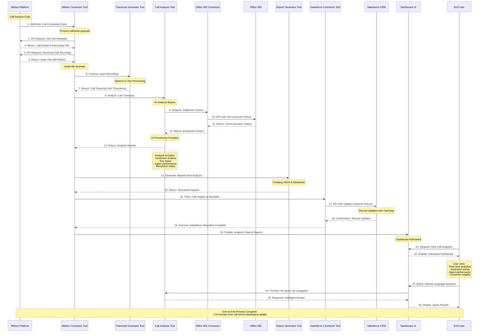

# Sequence Diagram - Call Analysis Data Flow

## Overview
This sequence diagram illustrates the chronological flow of interactions between system components from the moment a Webex call ends until the analytics appear on the dashboard and are integrated into Salesforce.

## Sequence Diagram

## Detailed Flow Description

### Phase 1: Call Completion & Data Collection (Steps 1-5)
**Duration: ~30 seconds**

1. **Call Ends**: Webex platform registers call completion
2. **Webhook Trigger**: Immediate notification sent to Webex Connector Tool
3. **Metadata Retrieval**: System fetches call details (duration, participants, timestamps)
4. **Recording Download**: Audio file retrieved from Webex storage
5. **Data Validation**: Ensure audio file integrity and metadata completeness

### Phase 2: Transcript Generation (Steps 6-7)
**Duration: ~1-2 minutes (depending on call length)**

6. **Audio Processing**: Speech-to-text conversion with speaker identification
7. **Transcript Delivery**: Formatted text with timestamps and speaker tags

**Technical Notes:**
- Processing time scales with call duration (typically 1:3 ratio)
- Supports multiple audio formats (MP3, WAV, proprietary Webex formats)
- Advanced noise reduction and speaker separation

### Phase 3: AI Analysis & Context Enhancement (Steps 8-13)
**Duration: ~30-60 seconds**

8. **Analysis Initiation**: Call Analysis Tool receives transcript
9. **Context Request**: Optional integration with Office 365 for additional customer data
10. **History Retrieval**: Customer communication history and calendar context
11. **Enhanced Context**: Enriched customer profile for better analysis
12. **AI Processing**: Multi-model analysis including:
   - Sentiment analysis with timeline tracking
   - Topic extraction and categorization
   - Agent performance evaluation
   - Issue resolution assessment
13. **Results Compilation**: Structured analysis output in JSON format

### Phase 4: Report Generation (Steps 14-15)
**Duration: ~15 seconds**

14. **Report Creation**: Generate both JSON and Markdown formats
15. **Report Delivery**: Structured data ready for consumption

**Output Formats:**
- **JSON**: Machine-readable analytics for API consumption
- **Markdown**: Human-readable reports with visualizations

### Phase 5: Salesforce Integration (Steps 16-19)
**Duration: ~20-30 seconds**

16. **Data Preparation**: Format insights for Salesforce compatibility
17. **CRM Update**: Push call metadata and analysis to customer records
18. **Confirmation**: Salesforce confirms successful record update
19. **Integration Complete**: System confirms successful Salesforce integration

**CRM Enhancements:**
- Customer record updated with call sentiment scores
- Automatic task creation for follow-up actions
- Call categorization and tagging
- Agent performance metrics linked to customer interaction

### Phase 6: Dashboard Update & User Interaction (Steps 20-26)
**Duration: Real-time**

20. **Dashboard Refresh**: Analytics data published to user interface
21. **User Access**: End user requests dashboard view
22. **Data Display**: Interactive analytics and visualizations presented
23. **Natural Language Query**: Optional intelligent querying capability
24. **Query Processing**: Langgraph processes natural language requests
25. **Intelligent Response**: AI-generated answers to user questions
26. **Results Display**: Query results presented in user-friendly format

## Performance Metrics

### Processing Times
- **Total End-to-End**: 2-5 minutes (varies by call length)
- **Transcript Generation**: 1-2 minutes (1:3 ratio to call duration)
- **AI Analysis**: 30-60 seconds
- **Salesforce Integration**: 20-30 seconds
- **Dashboard Update**: Real-time

### Scalability Considerations
- **Parallel Processing**: Multiple calls processed simultaneously
- **Queue Management**: Backlog handling during high-volume periods
- **Resource Allocation**: Dynamic scaling based on processing demand

### Error Handling & Recovery

#### Failure Points & Responses
1. **Webex API Unavailable**: Retry with exponential backoff (max 5 attempts)
2. **Audio Download Failure**: Alternative download methods and format conversion
3. **Transcription Errors**: Fallback to alternative speech-to-text services
4. **AI Analysis Failure**: Partial analysis delivery with error notifications
5. **Salesforce API Issues**: Queue-based retry system with manual override option
6. **Dashboard Update Failure**: Cached data serving with background refresh

#### Monitoring & Alerting
- **Real-time Status**: Live processing status for each call
- **Performance Metrics**: Response time and success rate tracking
- **Error Notifications**: Immediate alerts for system administrators
- **SLA Monitoring**: Automated tracking of service level agreements

## Integration Benefits

### Business Value
- **Immediate Insights**: Call analysis available within minutes of call completion
- **Automated Workflow**: Zero manual intervention required for standard processing
- **Enhanced CRM**: Salesforce records automatically enriched with call intelligence
- **Proactive Service**: Early identification of customer satisfaction issues

### Technical Advantages
- **Asynchronous Processing**: Non-blocking operations for optimal performance
- **Fault Tolerance**: Comprehensive error handling and recovery mechanisms
- **Scalable Architecture**: Horizontal scaling capabilities for high-volume environments
- **API-First Design**: Easy integration with additional systems and tools