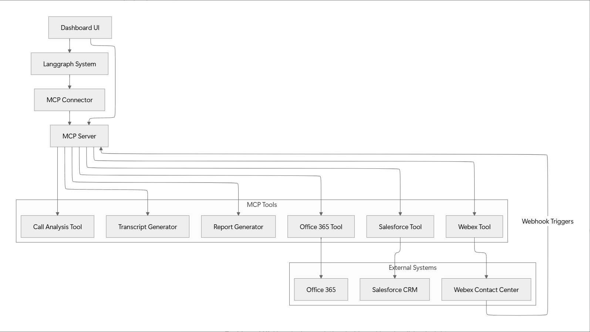

# AI Native Telecom Analytics – Solution Architecture Specification

## Overview

This solution provides a comprehensive AI-driven platform to collect, analyze, and visualize telecommunications data from multiple sources including Webex calls, Salesforce CRM, and Office 365. The system leverages machine learning for call analytics, sentiment analysis, and automated insights generation, aiming for a unified dashboard that provides actionable intelligence.

**Note:** We prioritize an AI-native rapid approach that demonstrates AI capabilities for business outcomes. For specific POCs, we focus on the core analytics components—collecting call data from Webex, creating transcripts, and pushing the insights to Salesforce.

## Core Architectural Components

### 1. MCP Server with MCP Tools

Primary integration hub containing all tool implementations:

- **Webex Connector Tool:** Retrieves call data and recordings
- **Salesforce Connector Tool:** Pushes call metadata and analysis
- **Office 365 Connector Tool:** Retrieves supplementary data
- **Transcript Generator Tool:** Converts call recordings to text
- **Call Analysis Tool:** Performs AI analysis on transcripts
- **Report Generator Tool:** Creates structured reports from analysis

### 2. Call Analysis Tool

Processes call transcripts using AI:

- **Sentiment analysis throughout calls**
- **Key phrase extraction and topic modeling**
- **Call categorization and tagging**
- **Agent performance evaluation**

Outputs analysis in JSON format for dashboard consumption

#### Example Call Analysis Output:

```json
{
  "call_id": "WX12345",
  "duration": "00:12:34",
  "overall_sentiment": "positive",
  "sentiment_timeline": [
    {"timestamp": "00:01:20", "sentiment": "neutral"},
    {"timestamp": "00:03:45", "sentiment": "negative"},
    {"timestamp": "00:10:15", "sentiment": "positive"}
  ],
  "key_topics": ["billing issue", "service upgrade", "technical support"],
  "resolution_status": "resolved",
  "agent_performance": {
    "response_time": "excellent",
    "solution_quality": "good",
    "empathy_score": "high"
  }
}
```

### 3. Data Flow Process

Streamlined data collection and processing:

- **Webhook triggers** from Webex for new call notifications
- **Direct API calls** to retrieve call recordings
- **Transcript generation** from audio files
- **AI analysis** of transcript content
- **JSON result generation** for dashboard consumption
- **Markdown report creation** (report.md) with visualizations
- **Data push to Salesforce** for customer record updates

### 4. Dashboard UI

Simple, effective visualization interface:

- **Connects to MCP Server** via MCP Connector
- **Displays analytics** from JSON responses
- **Renders markdown reports**
- **Provides filtering and search capabilities**
- **Offers natural language querying** through Langgraph

## Solution Architecture Diagram

{ width=100% }

## Legend

- **Dashboard UI:** User-facing analytics dashboard for visualizing insights
- **Langgraph System:** Natural language interface for querying the system
- **MCP Connector:** Middleware that routes requests between UI, Langgraph, and MCP server
- **MCP Server:** Central server hosting all tools as callable APIs
- **MCP Tools:** Specialized tools for each function (connectors, analysis, reporting)

## Implementation Workflow

1. **Data Collection:** Webhook triggers or scheduled jobs activate Webex Tool to collect call data
2. **Transcript Creation:** Call recordings are processed by Transcript Generator Tool
3. **AI Analysis:** Call Analysis Tool processes transcripts for insights
4. **Report Generation:** Analysis results are formatted as JSON and report.md
5. **Data Integration:** Call data and insights are pushed to Salesforce via Salesforce Tool
6. **Supplementary Data:** Additional context is retrieved from Office 365 when needed
7. **Visualization:** Dashboard UI displays analytics and reports from MCP Server responses

## Sample report.md Output

Reports will include key metrics, visualizations, and actionable insights in markdown format for easy rendering in the dashboard UI. These reports will highlight call trends, agent performance, customer satisfaction metrics, and recommended actions.